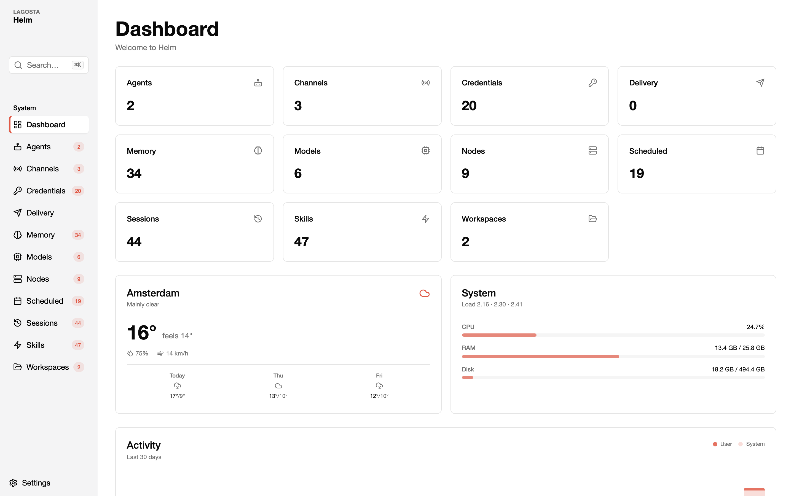

# Helm

Observability dashboard for [OpenClaw](https://openclaw.ai).



## What it does

Helm reads directly from your `~/.openclaw/` workspace and shows real system state — sessions, costs, cron jobs, credentials, memory, skills, nodes, and more. No database, no auth, no stubs.

## Pages

| Page | Shows |
|------|-------|
| **Dashboard** | 16 widget cards — weather, system, costs, agents, crons, sessions, nodes, Tailscale, channels, credentials, memory, models, skills, workspaces, activity, message queue |
| **Activities** | Tool calls, messages, cron runs — 30-day histogram + hourly heatmap |
| **Agents** | Configured agents, model bindings, session counts |
| **Channels** | Telegram, WhatsApp, Discord — health, queue status |
| **Costs** | Daily spend histogram, per-model breakdown, 30-day trend |
| **Credentials** | API keys and tokens — valid / expired / expiring soon |
| **Crons** | Scheduled jobs — next run, last status, agent, model |
| **Heartbeats** | Agent heartbeat history and manual trigger |
| **Memory** | All memory files with content viewer |
| **Messages** | Delivery queue — stuck messages, errors |
| **Models** | Configured LLMs with cron job usage linkage |
| **Nodes** | Paired devices — last seen, platform, role |
| **Sessions** | All sessions with token counts and cost (3 decimal EUR/USD) |
| **Skills** | Workspace, extension, and global skills |
| **Workspaces** | Agent workspaces and sizes |

## Features

- **⌘K command palette** — jump anywhere
- **Keyboard navigation** — ← → between pages, ESC for settings, ? for shortcuts
- **9 theme colors** (OKLCH) — persisted to localStorage
- **Server-side cache** — in-memory with 2-min background warmer, sub-10ms API responses
- **Client-side cache** — localStorage with 24h validity for dashboard widgets
- **Demo mode** — `DEMO_MODE=1` returns PII-free fixture data for safe screenshots
- **Sortable tables** with search filtering on all pages
- **Tooltips** — (i) icon on every page header explaining what it shows

## Setup

```bash
git clone https://github.com/michellzappa/helm
cd helm
pnpm install
cp .env.local.example .env.local
pnpm dev
```

Open [localhost:1111](http://localhost:1111).

### Auto-start (macOS)

```bash
cp launchagent.example.plist ~/Library/LaunchAgents/com.yourname.helm.plist
# Edit the path, then:
launchctl load ~/Library/LaunchAgents/com.yourname.helm.plist
```

## Stack

- Next.js 16 (Pages Router, Turbopack)
- React 19
- shadcn/ui + Tailwind CSS v4
- Lucide icons
- cmdk (command palette)
- croner (cron schedule parsing)
- Playwright (screenshots)

No database. No auth. Reads from the filesystem.

## Screenshot

`npm run screenshot` starts an ephemeral server with `DEMO_MODE=1` and captures a PII-free screenshot. Use `--live` for real data.

## License

MIT
